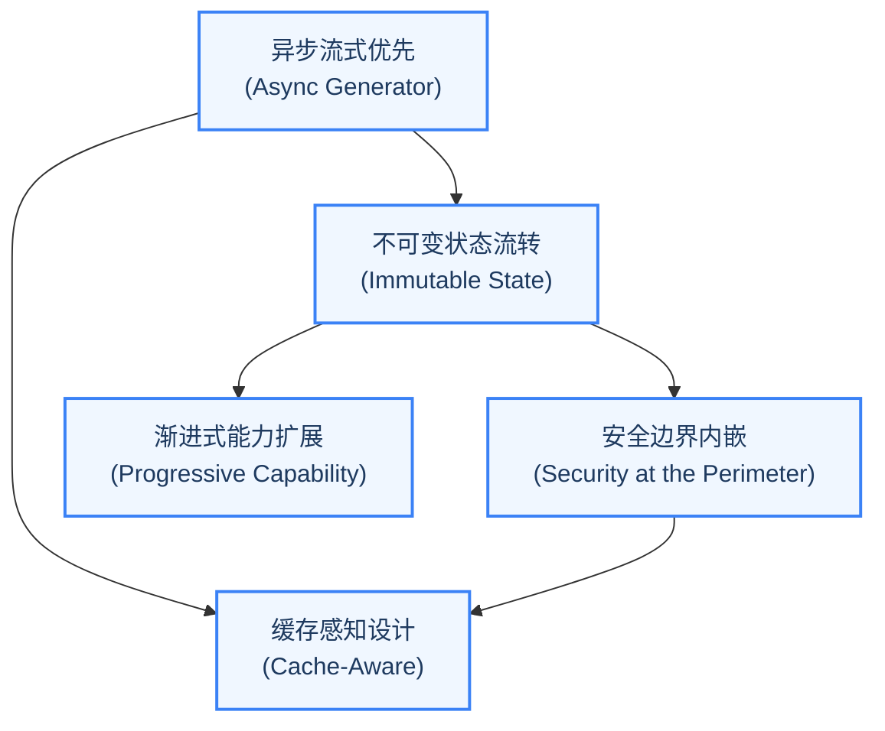

通过阅读 Claude Code 的架构，我们可以提炼出五个贯穿始终的设计原则。这些原则并非孤立的技巧，而是相互支撑的架构决策网络。每一个原则都回答了一个核心的"为什么"：为什么不选更简单的方案？如果不这样设计会怎样？

### 原则一：异步流式优先（Async Generator First）

Claude Code 的整个对话循环建立在 `AsyncGenerator` 之上。这不是一个随意的技术选择，而是一个深刻的架构决策。

传统的 LLM 调用通常采用请求-响应模式：发送 Prompt，等待完整响应，处理结果。但 Agent 的交互模式是根本不同的——Agent 可能在一个用户请求中执行多轮工具调用，每一轮都可能产生需要实时展示给用户的中间状态（思考过程、工具调用计划、执行进度）。

`AsyncGenerator` 完美地匹配了这个需求：

- **增量输出**：通过 `yield` 逐步产出流式事件，上层代码可以实时渲染。
- **可中断性**：调用者可以随时通过 `generator.return()` 或 `generator.throw()` 终止生成器。
- **背压控制**：如果消费者处理速度跟不上生产速度，生成器会自动暂停，避免内存溢出。

这种设计使得 Claude Code 的对话循环成为一个"事件流"而非"请求-响应对"。上层代码只需要一个 `for await...of` 循环就可以消费整个对话过程的所有事件。

**如果不这样设计会怎样？** 如果使用回调模式，每添加一种新事件类型就需要注册新的回调函数，随着事件类型的增多，代码会变成难以维护的"回调地狱"。如果使用 Promise 链，虽然解决了回调地狱，但失去了中途取消的能力——用户按 Ctrl+C 时无法优雅地停止正在进行的 API 调用。如果使用事件发射器（EventEmitter），虽然解决了取消问题，但引入了内存泄漏风险（忘记移除监听器）和类型安全问题（事件名是字符串）。

AsyncGenerator 是唯一同时满足"流式输出"、"可取消"和"类型安全"三个需求的方案。

### 原则二：安全边界内嵌（Security at the Perimeter）

Claude Code 的权限系统不是一个附加的安全层，而是被内嵌到了架构的核心管线中。工具调用从被 LLM 提出到最终执行，需要经过多个安全检查点：

1. **工具可见性过滤**：在将工具列表发送给 LLM 之前，根据权限规则过滤掉被禁止的工具。模型甚至无法"看到"它不应该使用的工具。
2. **输入校验**：工具的 `validateInput` 方法在权限检查之前执行，拒绝格式不合法的参数。
3. **权限决策**：`canUseTool` 回调综合考量权限模式（默认/Auto/Bypass）、工具的危险等级、用户的历史决策等因素，做出允许/拒绝/询问的决策。
4. **运行时防护**：即使通过了上述检查，工具执行过程中仍有沙箱限制、超时控制、输出大小限制等防护措施。

这个四阶段管线的设计哲学是"纵深防御"（Defense in Depth）——没有单一的安全检查点是"银弹"，但每一层都可以独立短路，阻止不安全的操作。

**为什么不使用简单的白名单？** 白名单方案看似简单，但存在致命缺陷：它假设所有操作都可以事先分类为"安全"或"不安全"。但现实中，安全性是上下文相关的——`rm -rf node_modules` 在开发环境中是安全的，但 `rm -rf /etc` 是危险的。同一个 Bash 工具、同一个命令模式，在不同参数下的风险等级完全不同。四阶段管线允许每一层根据上下文做出更精细的判断。

> **交叉引用：** 第 4 章将深入分析权限管线的四个阶段，包括规则匹配优先级、分类器自动审批和权限持久化机制。

### 原则三：缓存感知设计（Cache-Aware Architecture）

在 LLM 的 API 计价模型中，Prompt 缓存（Prompt Caching）可以显著降低成本和延迟。Claude Code 的架构从多个层面考虑了缓存友好性：

- **系统 Prompt 稳定性**：系统 Prompt 的构建方式被精心设计，确保在工具列表不变的情况下，Prompt 的字节内容保持一致，从而命中 API 侧的 Prompt 缓存。
- **子智能体的缓存共享**：Fork 模式下的子智能体会继承父智能体的 `renderedSystemPrompt`，避免重新生成可能因配置变化而不同的 Prompt，保证缓存命中率。
- **消息历史的不可变性**：已发送给 API 的消息不会被修改，只有追加新消息的操作，这保证了缓存键的稳定性。

缓存感知设计的影响是深远的：它不仅降低了 API 成本，还通过减少重复计算提高了响应速度，这对于需要频繁与 LLM 交互的 Agent 系统尤为关键。

**如果不这样设计会怎样？** 一个不关心缓存的 Agent 系统可能在每次 API 调用时都重新构建系统 Prompt，导致：(1) 每次 API 调用都需要处理完整的 Prompt，增加延迟和成本；(2) 微小的配置变化（如工具列表的排序变化）可能导致缓存全面失效；(3) 在子智能体场景下，父子智能体之间无法共享已缓存的 Prompt，导致重复计算。对于每天执行数百次 API 调用的生产级 Agent，这些浪费会迅速累积成可观的成本。

### 原则四：渐进式能力扩展（Progressive Capability）

Claude Code 提供了四级扩展模型，从内建到外部、从简单到复杂：

| 扩展级别 | 机制 | 适用场景 | 扩展者角色 |
|---------|------|---------|----------|
| **工具（Tool）** | 实现 `Tool` 类型接口 | 添加新的原子操作能力 | 核心开发者 |
| **技能（Skill）** | Markdown + 脚本的声明式工具 | 封装可复用的任务模板 | 高级用户 |
| **插件（Plugin）** | 带生命周期的工具包 | 组织相关工具和配置 | 生态开发者 |
| **MCP 服务器** | 标准化协议的外部工具集成 | 第三方工具生态 | 第三方开发者 |

这四级扩展模型的设计哲学是"渐进增强"：对于简单的需求，声明一个 Skill 就够了；对于复杂的集成，可以通过 MCP 协议连接外部服务。每一级都建立在前一级的基础之上，而非替代它。

特别值得关注的是 MCP（Model Context Protocol）的集成方式。Claude Code 不是一个封闭系统——它通过 MCP 协议可以动态发现和调用外部工具服务器提供的工具，这使得 Agent 的能力边界不是由开发者预设的，而是可以在运行时动态扩展的。

**如果不采用渐进式扩展会怎样？** 两种极端都不可取。如果只有"工具"一级扩展，第三方开发者必须修改核心代码才能添加新能力，这会严重限制生态系统的生长。如果只提供 MCP 一级扩展，简单的自定义需求也需要搭建一个完整的工具服务器，门槛过高。渐进式扩展让每一类贡献者都能在最适合自己的抽象层次上工作。

> **交叉引用：** 第三部分将详细讲解 MCP 协议的集成方式、插件系统的设计以及 Skill 的声明式工具定义。

### 原则五：不可变状态流转（Immutable State Flow）

Claude Code 的状态管理借鉴了 Redux/Zustand 的不可变状态模式。核心状态存储由一个极简的 store 实现完成。这个实现虽然简洁，但蕴含了重要的设计决策：

- **Updater 函数模式**：状态更新接收一个 `(prev: T) => T` 函数，而非新状态值本身。这确保了状态的每次更新都基于前一个状态，避免了竞态条件。
- **引用相等性检查**：通过引用比较确保只有真正发生变化时才触发通知，避免不必要的重渲染。
- **订阅/取消订阅模式**：监听器通过集合管理，返回清理函数，防止内存泄漏。

在对话循环层面，不可变性同样被严格遵守：跨迭代状态通过整体替换的方式更新，每次迭代开始时从状态对象解构出需要的字段，确保读操作使用的是不可变快照。

不可变状态流转的好处是多方面的：状态变化可预测、可追溯、可调试；在子智能体场景下，父智能体可以安全地将状态快照传递给子智能体而不担心被意外修改；在推测执行（Speculation）场景下，状态回滚变得简单而安全。

**如果不这样设计会怎样？** 如果使用可变状态（直接修改对象的字段），在并发场景下会出现经典的竞态条件：工具 A 的执行修改了状态，但工具 B 在读取状态时看到的是修改了一半的不一致数据。在子智能体场景下更危险——子智能体可能意外修改父智能体的状态，导致主循环的行为变得不可预测。这类 bug 极难复现和调试，因为它取决于异步操作的具体调度顺序。